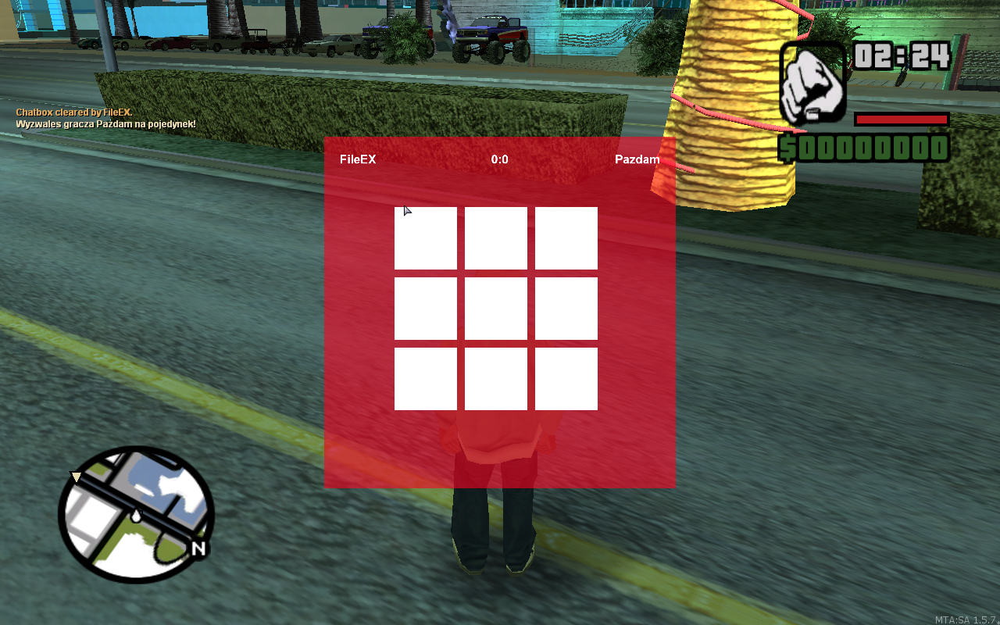
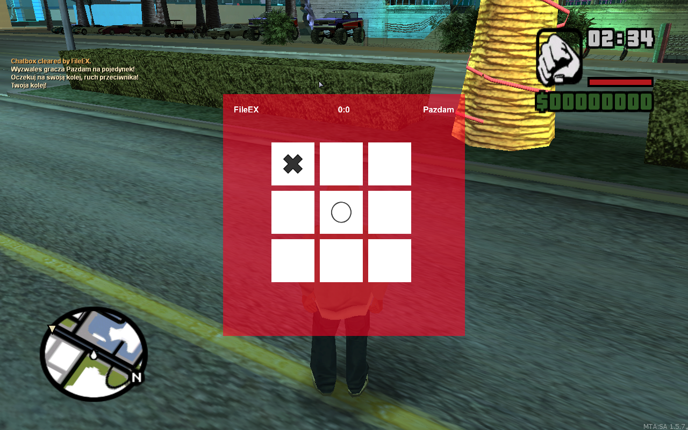
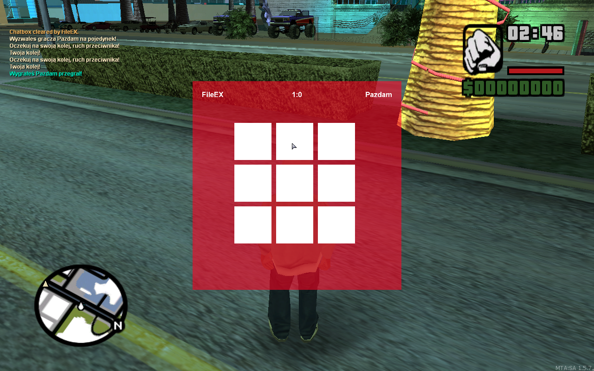
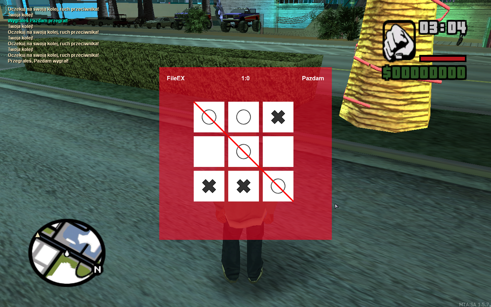
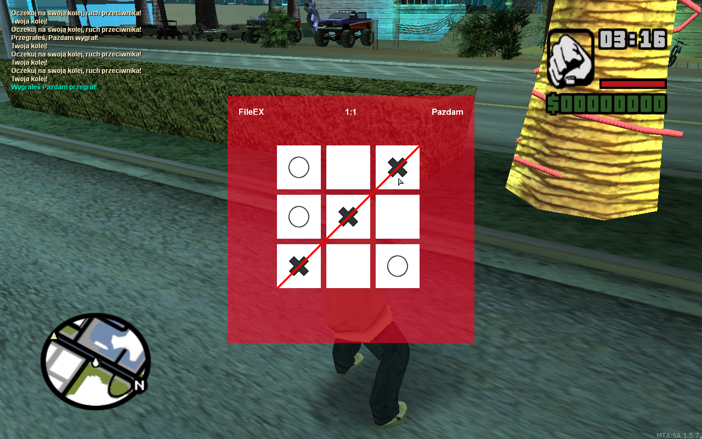

# MTA-SA---TicTac-Toe-minigame
Tic tac toe minigame with players

[PL]
  Kółko i krzyżyk z innymi graczami. Komenda /tc <nick>
  
  Gracz, który rozpoczyna **zawsze** ma krzyżyk, a drugi gracz kółko.
  
  Ikonki pochodzą z internetu.
 
 
**#Screeny**

**#Autorzy**
Autor: FileEX
Podziękowania, za testy: Pazdam

**#Kontakt**
Discord: FileEX#3656
